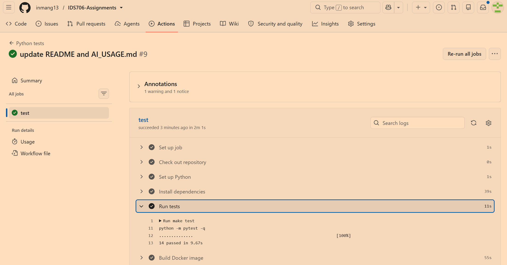
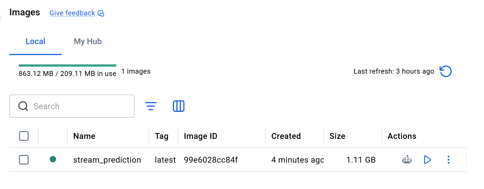
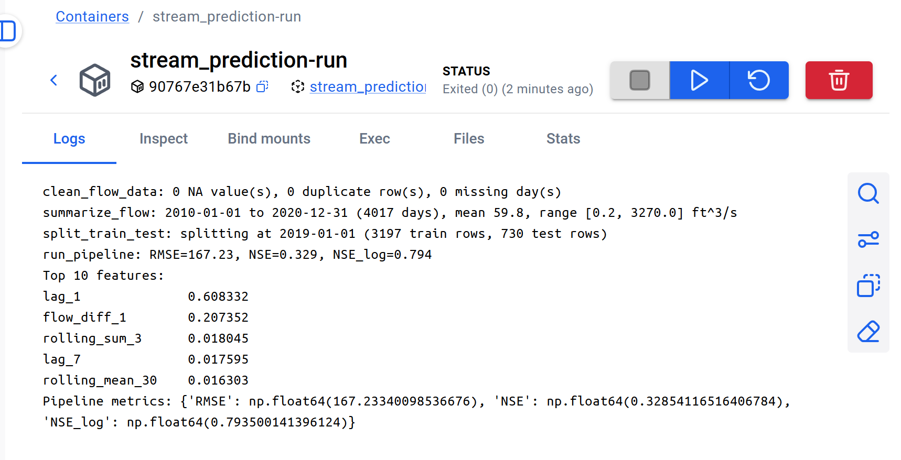
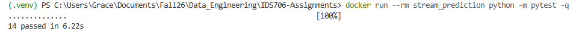

# IDS706-Assignments
[](https://github.com/inmang13/IDS706-Assignments/actions/workflows/test.yml)

## Project Description

Grace's repo for IDS 706 Data Engineering Systems assignments. Main
project: a streamflow forecasting pipeline (`src/main.py`) on USGS daily
discharge data for the Eno River, NC (2010-2020) — clean data, engineer
lag/rolling/calendar features, train a Random Forest, evaluate (RMSE,
NSE), and plot results.

### Problem Statement

Reliable next-day streamflow forecasts can help monitor river conditions and
identify unusually high-flow events. This project uses historical USGS
measurements from the Eno River at Hillsborough, NC, to clean daily discharge
data, engineer lag and rolling features, and evaluate a Random Forest model
for next-day streamflow prediction.

## Project Structure

- `src/main.py` - streamflow pipeline: load, clean, summarize, feature engineering, model training/evaluation, plotting
- `data/daily-data-mean.csv` - USGS daily mean discharge data
- `tests/test_main.py` - automated tests (unit + system)
- `output/` - plots generated by running the pipeline (git-ignored)
- `Dockerfile` - container configuration
- `Makefile` - common development commands
- `.github/workflows/test.yml` - GitHub Actions workflow
- `notebooks/draft_analysis.ipynb` - draft streamflow data analysis and forecasting notebook
- `notebooks/rust_vs_python_intro.ipynb` - Rust primer for Python users (requires a Rust Jupyter kernel)

## Installation

Create and activate a virtual environment if desired, then install the project dependencies:

```bash
python -m pip install -r requirements.txt
```

Or use the Makefile:

```bash
make install
```

## Running the Application

Run the full pipeline with:

```bash
python src/main.py
```

Or:

```bash
make run
```

Runs the full pipeline end-to-end, prints metrics (RMSE, NSE, log-NSE),
and saves plots to `output/`.

## Running Tests

Run the tests locally with:

```bash
python -m pytest -q
```

Or:

```bash
make test
```

Check formatting and linting locally with:

```bash
make format-check
make lint
```

The GitHub Actions workflow runs the tests, builds the Docker image, and runs the test suite inside Docker for every push and pull request.



## Refactoring Overview

The analysis was refactored from notebook-focused code into reusable functions
in `src/main.py`. The pipeline now separates data loading, cleaning,
summarization, feature engineering, model training, evaluation, and plotting.
This makes the workflow easier to test, reuse locally or in Docker, and run in
CI without relying on notebook state.

The refactoring also added a repository-relative data path, chronological
train/test splitting, seeded model training, headless plotting for CI, and
explicit data-quality reporting. The changes were verified with the automated
test suite, Black formatting, Flake8 linting, local pipeline execution, and
Docker-based tests.

## Docker

Make sure Docker Desktop is running, then build and run the application:

```bash
make docker-build
make docker-run
```

To run the tests inside the container:

```bash
make docker-test
```

### Docker Evidence

Successful image build and image listing:



Application running successfully in a container:



Tests passing inside the container:



## Notebooks

`notebooks/draft_analysis.ipynb` analyzes USGS daily mean discharge data (Eno River at Hillsborough, NC, 2010-2020). Covers data cleaning, monthly/seasonal/yearly flow statistics, boxplot visualizations, and a next-day flow forecast comparing XGBoost and Random Forest models on lag/rolling/calendar features.

`notebooks/rust_vs_python_intro.ipynb` introduces Rust from a Python starting point, motivated by the Rust engines behind fast Python tools such as Polars. Covers the parts that look familiar (variables, conditions, loops), then move semantics, ownership, and borrowing, including a mutation bug Python runs happily and Rust rejects at compile time. Runs on a Rust Jupyter kernel rather than Python; a few cells are meant to fail to compile.

